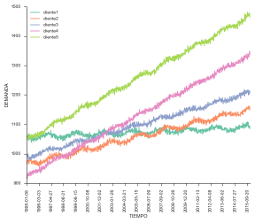
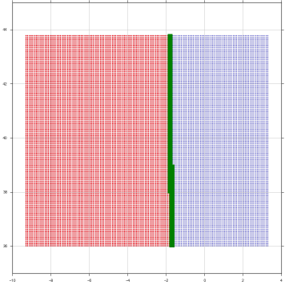
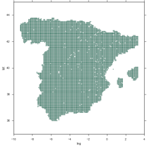

# MEMORIA - GRUPO I
Para este trabajo se ha planteado un problema de transportes, siguiendo la propuesta del profesor. 

El problema consta de una empresa cuyo objetivo es colocar un almacen de forma que minimice los costes, para ello tenemos como datos: 5 clientes, los costes (coste de transporte e impuestos) y una demanda. El problema consistes en hallar la localización óptima para esta empresa.

El trabajo sigue la línea desarrollada en las tutorías, de forma que el primer problema es el planteamiento inicial y luego se van añadiendo nuevos ingredientes.

Se puede acceder al código del trabajo y presentación, en el siguiente [enlace](http://nbviewer.ipython.org/github/mmngreco/SIAD/blob/master/Trabajo%20Grupo/mapa.ipynb).

## DATOS

### CLIENTES

Los datos han sido generados aleatoriamente siguiendo un esquema de serie temporal.
$$y_t = δ_0 + δ_1·t + u_t$$
>Donde:
- $y_t$: Ventas para cada período t.
- $δ_0$: Ventas indendientes o autónomas. (Stock de Seguridad pe.)
- $δ_1$: Pendiente la recta.
- $u_t$: Ruido ~ N(0, 5)

En este caso para darle más realismo, $δ_0 = δ_a + δ_b·sin(x)$, de esta forma introducimos un posible componente estacional, que depende de cuán grande sea $δ_b$.

Se ha procurado que cada cliente tenga una pendiente y un valor inicial distinto. La forma de la serie temporal sigue una función seno o coseno aleatoriamente.

### COSTES TRANSPORTE

Los costes de transporte por kilómetro han sido obtenido del informe porporcionado por el *Observatorio de Costes del Transporte de Mercancías por Carretera (Enero 2015)*, para un VEHÍCULO ARTICULADO DE CARGA GENERAL (página 10 del documento.)[^1] y se ha tomando para los cálculos la media entre los Costes directos (€ / km recorrido) y Costes directos (€ / km cargado).

[^1]: Observatorio de Costes del Transporte de Mercancías por Carretera (Enero 2015) [http://www.fomento.gob.es/NR/rdonlyres/75019EB9-D1D4-48DD-B58C-91FBD81E8E3B/129718/ObservatorioCostesMercanciasenero2015.pdf](http://www.fomento.gob.es/NR/rdonlyres/75019EB9-D1D4-48DD-B58C-91FBD81E8E3B/129718/ObservatorioCostesMercanciasenero2015.pdf)

### MAPA y COORDENADAS

Para poder hacer el trabajo más práctico hemos hecho un muestreo del territorio por coordenadas en decimales proporcionadas directamente por Google Maps. Esto nos permite tener para el área de España, las coordenadas límites de las comunidades autónomas.

Este muestreo consiste en veintemil puntos, dentro del mínimio rectángulo que pueda dibujarse sobre el mapa de España. Para esto se coje el valor con latitud mayor y menor, luego con logitud mayor y menor, y a continuación se generan valores identicamente distribuidos entre dichos valores. De forma que el restulado es una “rejilla” de este tipo:

Luego con la API de Google Maps se obtiene información país, comunidad autónoma, provincia de cada punto, y se guarda para su posterior uso. Al final, el nivel de región usado para el trabajo ha sido por Comunidades Autónomas, ya que la API de Google Maps no proporciona información completa para las provincias.

El restultado ha sido el siguiente:

Con este muestreo, que no es más que una discretización del territorio, se soluciona el problema de incertidumbre en el cálculo de la optimización, al poder asignar a cada punto del mapa de España una unica comunidad autónoma a la que poder asignarle carácterísticas además de crear un “puente” entre las comunidades (cualitativa) y las coordenadas (cuantitativa, variable de desición) y poder tratar matemáticamente. Hay una ventaja añadida, y es que permite proporcionar un resultado instantáneo sin necesidad de acudir a Google Maps para conocer la situación geográfica del resultado.

También fué necesario realizar una homogeneización de los datos, ya que los nombres de las comunidades autónomas proporcionados por la API de Google Maps estaban en distintos idiomas.

Es importante notar que hay puntos en los que la API no ha devuelto ningún resultado, por eso existen puntos vacíos, sin embargo esto no es un problema ya que el número es muy reducido y el error que pueden provocar es mínimo.

### IMPUESTOS

Los impuestos han sido generados aleatoriamente siguiendo una distribución uniforme(0,1).

## OPTIMIZACIÓN

En el primer problema, se plantea una optimización lineal de forma que la función objetivo sea minimizar las distancias. En esta optimización se usa el alogritmo del simplex ya que la función objetivo es continua y cóncava.

En el segundo problema se añade la variable impuesto que depende de la comunidad autónoma en la que nos econtremos. Es importante añadir un impuesto infinito para que la solución se encuentre en España, esta restricción se ha incluido añadiendo un condicional, dado que la distancia media entre los puntos es de 0.01 (aproximadamente 7 km) si se supera dicha distancia el impuesto que se asocia es infinito. En esta optimización se hizo necesario utilizar un algoritmo de búsqueda global, se uso el algoritmo de fuerza bruta para hallar el óptimo, ya que el simplex daba una solución local y no global. Esto se debe a que la función objetivo no es continua sino que tiene escalones provocados por los impuestos.

Para la optimización multicriterio, se plantea un problema de Programación por metas MINIMAX o de Tchebychev. Una meta es minimizar el pago de impuestos y la otra meta tiene por objetivo minimizar los costes de transporte. A ambas metas se le asigna un valor superior al óptimo global, esperando que tener en las variables por defecto valores positivos, como al final sucede.

## RESÚMEN

||lat |lng|fun_obj|ccaa|
|---:|:---:|:---:|:---:|:---:|
|res1(\*)|42.301562|-2.437683|1312334.971653|  RI|
|res2|41.170716|-3.514011|1562079.962388|  MD|
|res3|41.177927|-2.599561|1702859.918670|  CM|

(\*): La función objetivo no incluye el pago en impuestos.

## CONCLUSIÓN

Es importante notar que el método de optimización importa a la hora de hallar una solución, dependiendo de los márgenes que maneje la empresa, el resultado varía en aproximadamente 150000 unidades monetarias de diferencia según el resultado 2 y el resultado 3. Sin embargo se puede ver que geográficamente no existe una gran diferencia. La solución óptima sin duda es la proporsionada por la respuesta 2 (res2) ya que es dónde se minimiza los costes.

## SOFTWARE

Para casi la totalidad del trabajo, se usa el lenguage de programación [Python](link1), como interfaz de usuario Jupyter, para el cálculo matemático la librería [SciPy](link2). Se han implementado las ideas dadas en clase sobre Solver en Python.

[link1]: https://es.wikipedia.org/wiki/Python
[link1]: https://es.wikipedia.org/wiki/SciPy